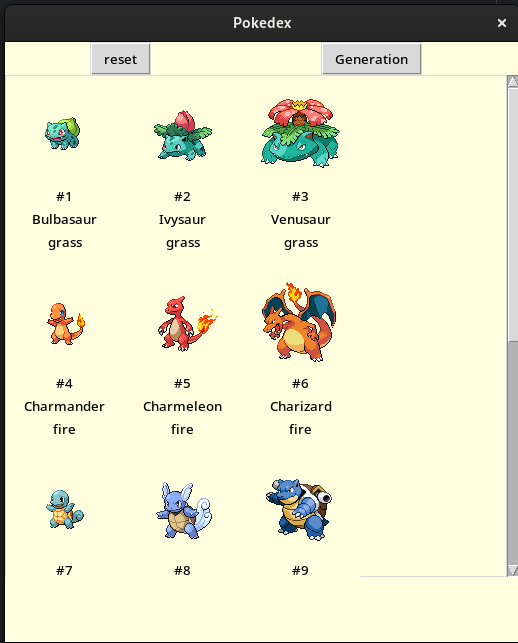

<h1>Pokedex App</h1> 
<h2>For now app allows to select Generation from list menu (open with clicking generation),
supports all generation from first gen to the Scarlet&Violet.
Reset button clears the canvas and stops generating further Pokemon indexes.  
Caching: On first usage app downloads sprites locally so that next time they can load faster.</h2>
<h3>API: PokeAPI and modules: 
-tkinter 
-pokebase 
-PIL 
</h3>

